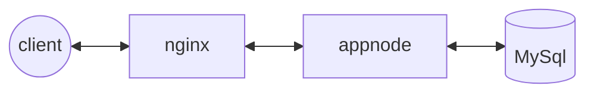

# Desafio Docker Node com Nginx Full Cycle

Esse projeto se trata de um aplicação node bem simples. Com função de escrever, ler dados no mysql e exibir esses dados (nomes cadastrados) numa página html.

Para isso utilizamos o Nginx como proxy reverso.



Para que você possa ver esse projeto funcionando basta executar o seguinte comando docker na raiz do projeto:

```yaml 
docker compose up -d
```
Aguarde os containers ficarem prontos e acesse:
```
http://localhost:8080
```
